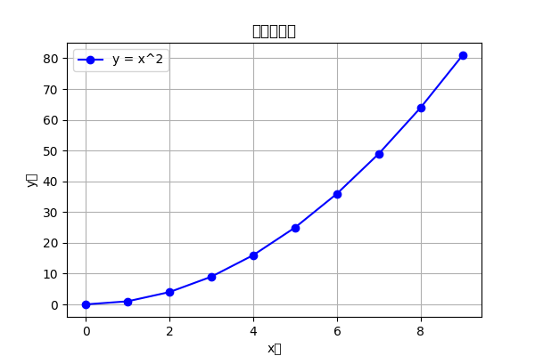
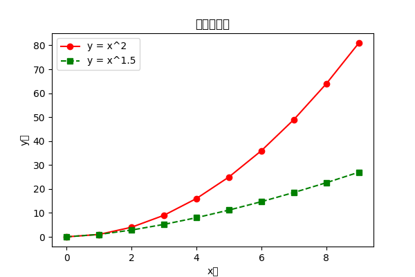
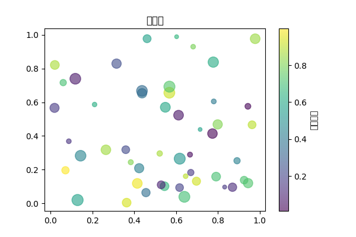
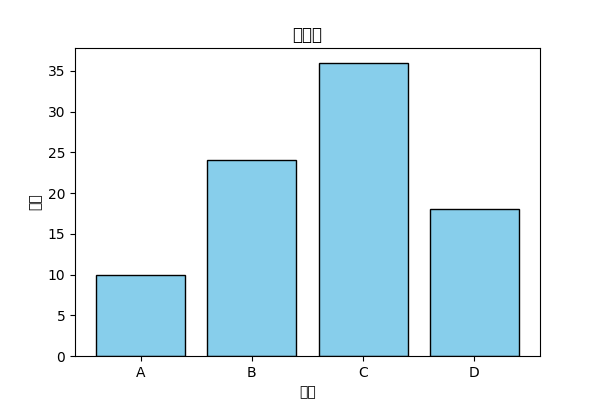
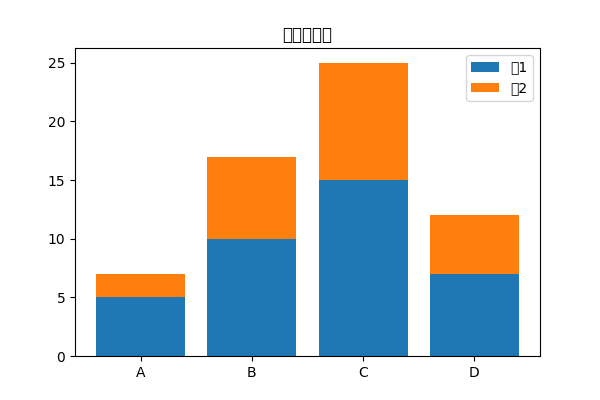
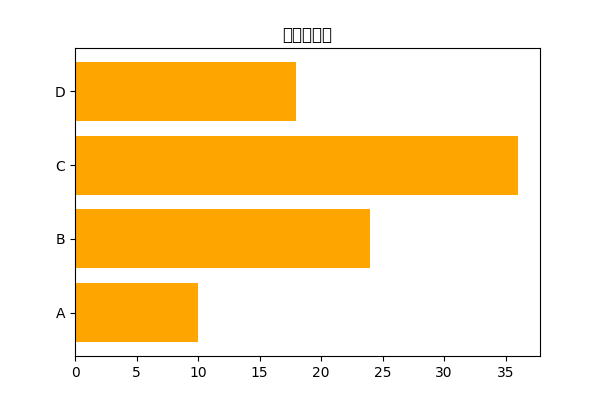
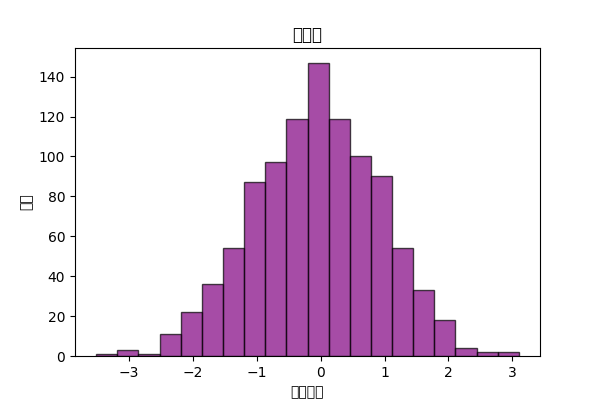
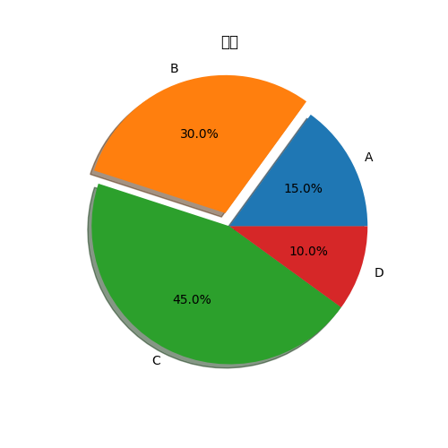
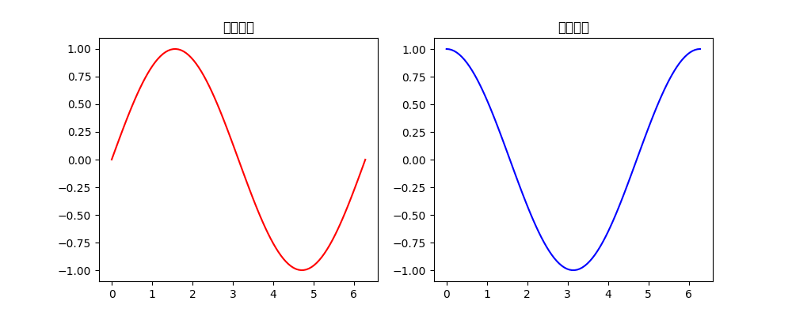
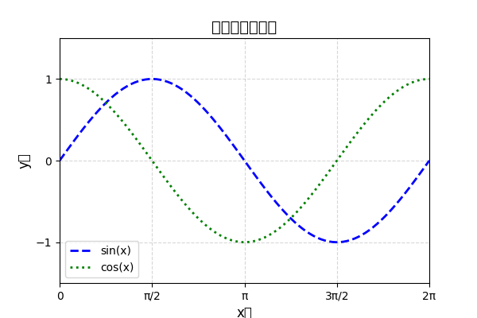

# Matplotlib

[`Matplotlib`](https://matplotlib.org/)，Matplotlib 是一个功能强大且全面的 Python 库，用于创建各种​**静态、动态和交互式可视化图表**​。它是 Python 数据科学生态系统中的基石，被广泛应用于学术研究、数据分析和工程领域。。

* **多种图表类型**
  * 折线图（line plot）
  * 散点图（scatter plot）
  * 条形图（bar chart）
  * 直方图（histogram）
  * 饼图（pie chart）
  * 热力图（heatmap, 结合 `imshow`）
  * 3D 图（结合 `mpl_toolkits.mplot3d`）
* **高度可定制化**
  * 可以控制坐标轴、标题、图例、颜色、样式等几乎所有细节。
* **和 NumPy/Pandas 配合紧密**
  * Matplotlib 可以直接绘制 NumPy 数组和 Pandas DataFrame 的数据，非常方便做科学计算和数据分析的可视化。

---

## 如何使用

### 1. 折线图

```
x = np.arange(0, 10, 1)
y = x ** 2
plt.figure(figsize=(6,4))
plt.plot(x, y, color='blue', linestyle='-', marker='o', label='y = x^2')
plt.title("基础折线图")
plt.xlabel("x轴")
plt.ylabel("y轴")
plt.legend()
plt.grid(True)
plt.show()
```



### 2. 多条折线

```
y2 = x ** 1.5
plt.figure(figsize=(6,4))
plt.plot(x, y, 'r-o', label='y = x^2')
plt.plot(x, y2, 'g--s', label='y = x^1.5')
plt.title("多条折线图")
plt.xlabel("x轴")
plt.ylabel("y轴")
plt.legend()
plt.show()
```



### 3. 散点图

```
np.random.seed(0)
x = np.random.rand(50)
y = np.random.rand(50)
sizes = np.random.randint(20, 200, size=50)
colors = np.random.rand(50)
plt.figure(figsize=(6,4))
plt.scatter(x, y, s=sizes, c=colors, alpha=0.6, cmap='viridis')
plt.title("散点图")
plt.colorbar(label='颜色映射')
plt.show()
```



### 4. 条形图

```
categories = ['A', 'B', 'C', 'D']
values = [10, 24, 36, 18]

plt.figure(figsize=(6,4))
plt.bar(categories, values, color='skyblue', edgecolor='black')
plt.title("条形图")
plt.xlabel("类别")
plt.ylabel("数值")
plt.show()
```




### 5.堆叠条形图 & 横向条形图

```
values1 = [5, 10, 15, 7]
values2 = [2, 7, 10, 5]

# 堆叠条形图
plt.figure(figsize=(6,4))
plt.bar(categories, values1, label='组1')
plt.bar(categories, values2, bottom=values1, label='组2')
plt.title("堆叠条形图")
plt.legend()
plt.show()
```



```
# 横向条形图
plt.figure(figsize=(6,4))
plt.barh(categories, values, color='orange')
plt.title("横向条形图")
plt.show()
```



### 6.直方图

```
data = np.random.randn(1000)
plt.figure(figsize=(6,4))
plt.hist(data, bins=20, color='purple', edgecolor='black', alpha=0.7)
plt.title("直方图")
plt.xlabel("数值区间")
plt.ylabel("频数")
plt.show()
```



### 7.饼图

```
sizes = [15, 30, 45, 10]
labels = ['A', 'B', 'C', 'D']
explode = (0, 0.1, 0, 0)

plt.figure(figsize=(5,5))
plt.pie(sizes, labels=labels, explode=explode, autopct='%1.1f%%', shadow=True)
plt.title("饼图")
plt.show()

```



### 8.子图

```
x = np.linspace(0, 2*np.pi, 100)
y1 = np.sin(x)
y2 = np.cos(x)

plt.figure(figsize=(10,4))
plt.subplot(1, 2, 1)   # 1行2列第1个
plt.plot(x, y1, 'r')
plt.title("正弦曲线")

plt.subplot(1, 2, 2)   # 1行2列第2个
plt.plot(x, y2, 'b')
plt.title("余弦曲线")
plt.show()

```



### 9.定制图

```
plt.figure(figsize=(6,4))
plt.plot(x, y1, label='sin(x)', color='blue', linewidth=2, linestyle='--')
plt.plot(x, y2, label='cos(x)', color='green', linewidth=2, linestyle=':')
plt.title("高级定制折线图", fontsize=14)
plt.xlabel("x轴", fontsize=12)
plt.ylabel("y轴", fontsize=12)
plt.xlim(0, 2*np.pi)
plt.ylim(-1.5, 1.5)
plt.xticks([0, np.pi/2, np.pi, 3*np.pi/2, 2*np.pi],
           ['0', 'π/2', 'π', '3π/2', '2π'])
plt.yticks([-1, 0, 1])
plt.legend()
plt.grid(True, linestyle='--', alpha=0.5)
plt.show()
```

