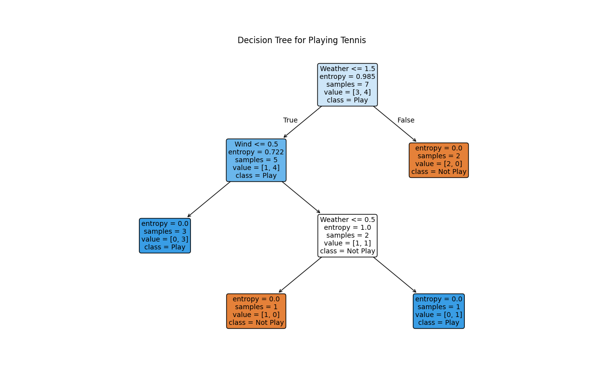
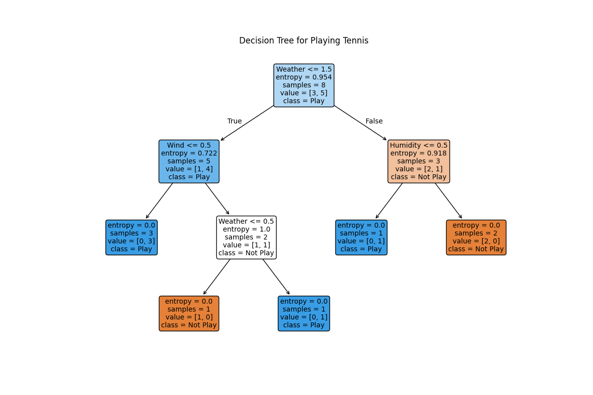

# 决策树算法

[决策树](https://www.showmeai.tech/article-detail/190)的核心思想是模仿人类做**决策的过程**，通过一系列的“是/非”问题，最终导向一个决策结果。

这个决策过程可以用一个树形结构来表示：

* **根节点 (Root Node)**：代表最初的决策点，比如“天气如何？”。
* **内部节点 (Internal Node)**：代表对某个特征（属性）的测试，比如“湿度是否大于70%？”。
* **分支 (Branch)**：代表一个测试的输出，比如“天气”这个节点可以有“晴天”、“阴天”、“雨天”三个分支。
* **叶节点 (Leaf Node)**：代表最终的决策结果，比如“去打球”或“不去打球”。

## 1. 信息熵

消除不确定性所需信息量的度量，也是未知事件可能含有的信息量，可以度量样本集合「纯度」。

对应到机器学习中，假定当前数据集 公式 中有 公式 类，其中第 公式 类样本占比为 公式，则信息熵的计算公式如下：

$$
\mathrm{Entropy}(D) = - \sum_{i=1}^k p_i \cdot \log_2 p_i
$$

## 2.实验

### 2.1\. 每个节点的关键信息

* **决策规则 (Condition)**：顶部的条件，例如 `Weather <= 1.5`
* **信息熵 (entropy)**：衡量当前节点数据纯净度

* `entropy = 0.0` → 节点所有样本属于同一类（纯净）
* 值越高 → 混乱度越大
* **样本数 (samples)**：落入该节点的样本数
* **样本分布 (value)**：显示样本在不同类别中的数量

* 例如：`value = [3, 4]` → 3 个“不去打球”，4 个“去打球”
* **主要类别 (class)**：占比最多的类别 → 预测结果
* **颜色 (可视化中)**：代表主要类别，颜色越深表示纯度越高

---

### 2.2\. 决策流程

#### 第 1 步：根节点

* **问题**：`Weather <= 1.5?`
* **编码规则**：晴天 = 2，阴天 = 1，雨天 = 0
* **含义**：天气是 阴天或雨天 吗？
* **状态**：

* `samples = 7`（全部训练样本）
* `value = [3, 4]`
* `entropy = 0.985` → 数据混乱程度高

---

#### 第 2 步：根据天气分流

* **True (阴天或雨天) → 左子节点**

* `samples = 5`
* `value = [1, 4]` → `class = Play`
* 继续提问：`Wind <= 0.5?`
* **False (晴天) → 右叶子节点**

* `samples = 2`
* `value = [2, 0]`
* `entropy = 0.0` → 纯净
* **结论**：如果天气是晴天 → **不去打球 (Not Play)**

---

#### 第 3 步：深入左侧分支 (阴天或雨天)

* **条件**：`Wind <= 0.5`

1. **True (弱风/无风) → 左下角叶子节点**

* `samples = 3`
* `value = [0, 3]`
* `entropy = 0.0` → 纯净
* **结论**：去打球 (Play)
2. **False (强风) → 中间节点**

* `samples = 2`
* `value = [1, 1]`
* `entropy = 1.0` → 最混乱
* 继续提问：`Weather <= 0.5?` (是否为雨天)

`让我稍微调整一下代码，就会有不一样的结果（详细看DecisionTree.py）
将训练数据增加，晴天的时候增加更多的可能性`

#### **第1步：根节点提问**

决策树首先查看全部 **8 个** 训练样本 (`value = [3, 5]`)，并提出第一个问题：

> **`Weather <= 1.5` 吗？**

*(这里假设天气被编码为数字，例如：雨天=0, 阴天=1, 晴天=2)* 这个问题实际上是在问：“天气是雨天或者阴天吗？”

* 如果答案是 **True** (是雨天或阴天)，则沿着左边的分支走。
* 如果答案是 **False** (是晴天)，则沿着右边的分支走。

#### **第2步：兵分两路**

#### **左侧分支 (天气为雨天或阴天)**

进入这个分支后，有 5 个样本 (`value = [1, 4]`)。模型继续提问：

> **`Wind <= 0.5` 吗？**

*(假设：无风=0, 有风=1)* 这个问题是在问：“当前有风吗？”

* 如果答案是 **True** (无风)，则进入左下方的蓝色**叶节点**。

* **最终结论**: **去打球 (Play)**。这里的3个样本都指向“去打球”。
* 如果答案是 **False** (有风)，则进入中间的节点，这里样本最混乱 (`entropy = 1.0`)。模型需要再提一个问题来区分：

> **`Weather <= 0.5` 吗？** (是雨天吗？)

* 如果 **True** (是雨天且有风)，结论是 **去打球 (Play)**。
* 如果 **False** (是阴天且有风)，结论是 **不去打球 (Not Play)**。

#### **右侧分支 (天气为晴天)**

进入这个分支后，有 3 个样本 (`value = [2, 1]`)。模型提问：

> **`Humidity <= 0.5` 吗？**

*(假设：湿度正常=0, 湿度高=1)* 这个问题是在问：“湿度是正常的吗？”

* 如果答案是 **True** (晴天且湿度正常)，则进入左下方的蓝色**叶节点**。

* **最终结论**: **去打球 (Play)**。
* 如果答案是 **False** (晴天且湿度高)，则进入右下方的橙色**叶节点**。

* **最终结论**: **不去打球 (Not Play)**。

